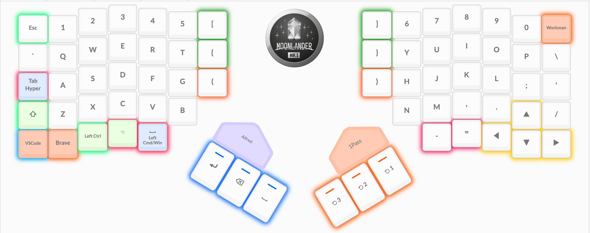
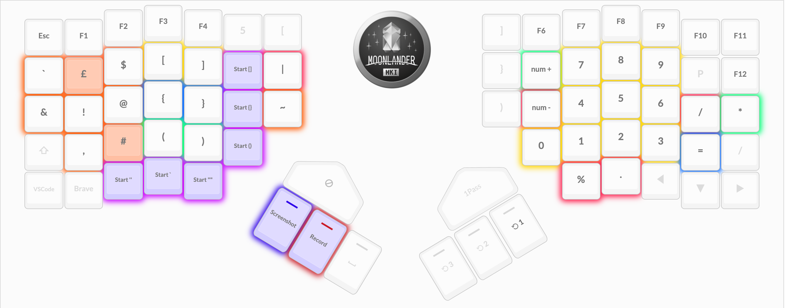
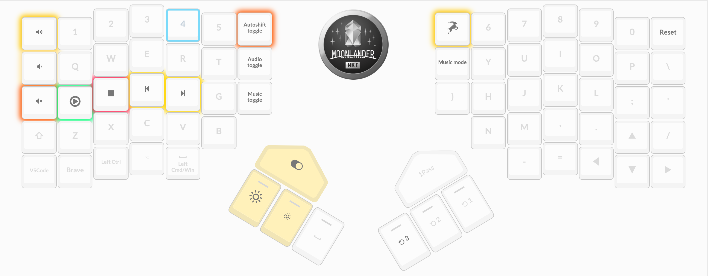
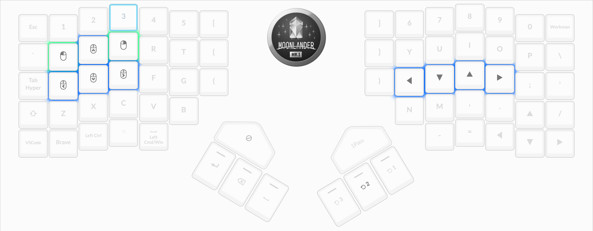

# Introduction

My config file for the [ZSA Moonlander](https://www.zsa.io/moonlander/)

Customise [https://configure.ergodox-ez.com/moonlander/layouts/Kvgl9/latest/0](here)

## Requirements

* Moonlander Keyboard
* [Wally](https://www.zsa.io/wally/)

## Practice Websites
* [Keybr](https://www.keybr.com/)
* [Monkeytype](https://monkeytype.com/)

# QWERTY Layer

# Symbols Layer

# Media Layer

# Navigation Layer

